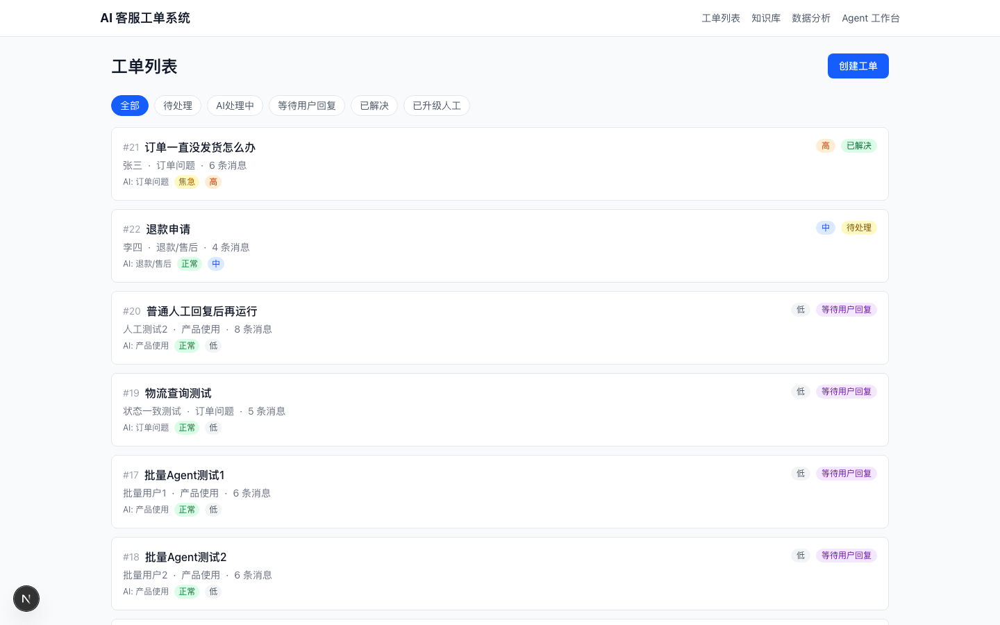
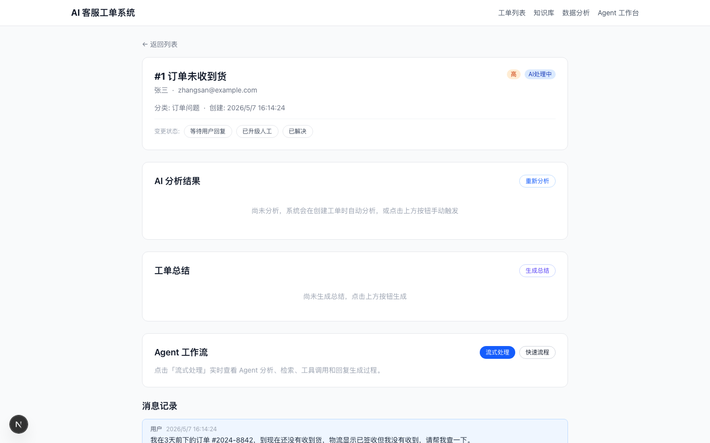
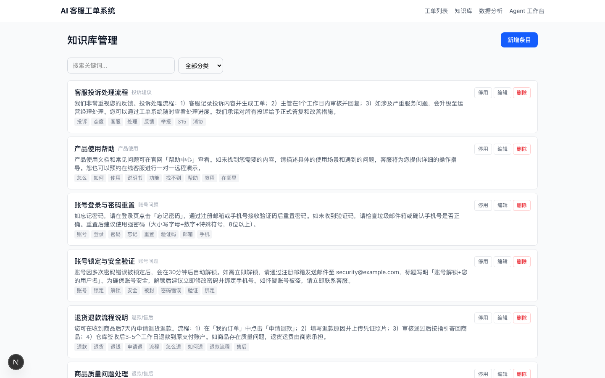
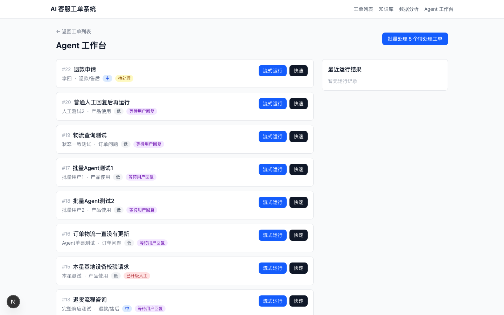
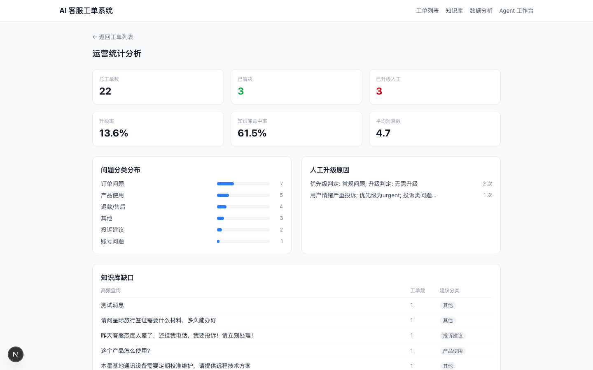
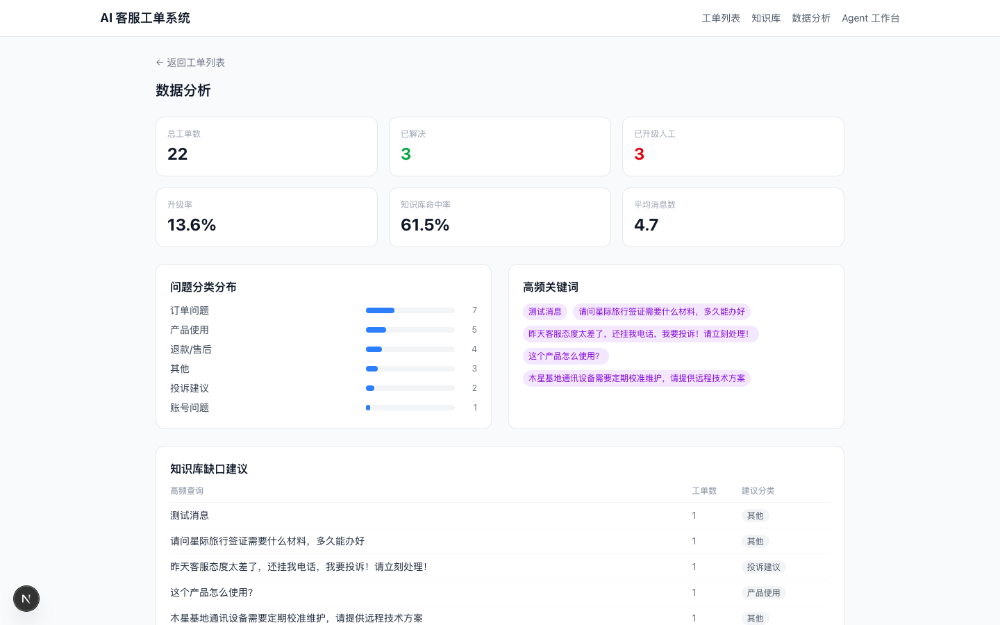
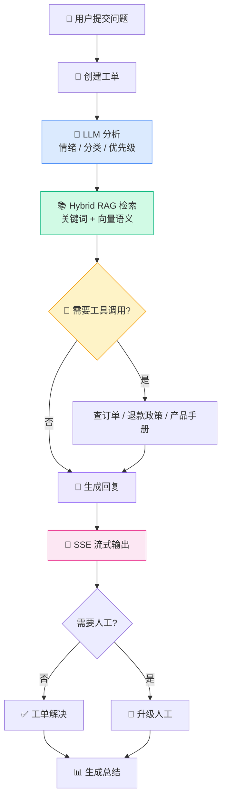

# 🤖 AI 客服工单处理 Agent

[](https://www.python.org/)
[](https://fastapi.tiangolo.com/)
[](https://nextjs.org/)
[](https://react.dev/)
[](https://www.typescriptlang.org/)
[](https://tailwindcss.com/)
[](https://deepseek.com/)
[](./LICENSE)

一个面向电商 / SaaS 场景的 **AI Native 客服工单处理系统**。集成 LLM 智能分析、Hybrid RAG 语义检索、Tool Calling（工具调用）、SSE 流式回复生成，实现从问题分析到自动回复的全链路 Agent 闭环。

> 🎯 适合作为 AI Agent / LLM 应用方向的**面试作品**或**课程项目**。

---

## 📸 界面预览

> 启动项目后，访问对应页面截图替换下方占位。

| 工单列表 | 工单详情 + AI 分析 |
|----------|-------------------|
|  |  |

| 知识库管理 | Agent 工作台 |
|-----------|-------------|
|  |  |

| 运营统计 | 数据分析 |
|---------|---------|
|  |  |

---

## ✨ 核心功能

| 功能 | 说明 |
|------|------|
| 🧠 **LLM 智能分析** | 自动识别用户情绪、问题分类、优先级，判断是否需要人工介入 |
| 📚 **Hybrid RAG 检索** | 关键词匹配 + 向量语义检索融合，精准命中知识库条目 |
| 🔧 **Tool Calling** | Agent 可调用查订单、查退款政策、查产品手册、升级人工等工具 |
| 💬 **SSE 流式回复** | 实时流式生成客服回复，前端逐步渲染（打字效果） |
| 📊 **工单总结 & 统计** | 自动生成结构化工单总结，多维度运营统计分析 |
| ⚡ **批量 Agent 处理** | 一键批量运行待处理工单的完整 Agent 工作流 |
| 🛡️ **LLM 降级策略** | LLM 不可用时自动切换规则引擎，零外部依赖仍可运行 |

---

## 🏗️ 系统架构



### Agent 工作流（单票完整链路）

```
分析 → RAG 检索 → Tool Calling → 流式生成回复 → 保存消息 → 生成总结
```

### 降级策略

```
LLM_ENABLED=true  ───>  DeepSeek API（结构化输出 + 流式生成）
       ↓ 失败
LLM_ENABLED=false ───>  规则引擎（关键词分析 + 模板回复）
```

---

## 🛠️ 技术栈

| 层级 | 技术 | 说明 |
|------|------|------|
| **前端** | React 19 / Next.js 16, TypeScript 5, Tailwind CSS 4 | App Router, Turbopack, 全客户端渲染 |
| **后端** | Python 3.10+, FastAPI, SQLAlchemy 2, SQLite | 单文件部署，零配置数据库 |
| **AI** | DeepSeek API (OpenAI 兼容), 自研 Agent 框架 | 结构化输出, Function Calling, Embedding |
| **检索** | 关键词评分 + 向量余弦相似度 | Hybrid RAG, 内存向量存储 |
| **流式** | SSE (sse-starlette) + Fetch ReadableStream | 实时逐字渲染 |

---

## 🚀 快速开始

### 环境要求

- Python 3.10+
- Node.js 18+
- DeepSeek API Key（可选，不配置则使用规则引擎）

### 1. 启动后端

```bash
cd backend
pip install -r requirements.txt
cp .env.example .env          # 编辑 .env 填入 API Key
python seed.py                # 初始化数据库 + 种子数据
uvicorn main:app --reload --port 8000
```

后端运行在 http://localhost:8000，API 文档 http://localhost:8000/docs

### 2. 启动前端

```bash
cd frontend
npm install
npm run dev
```

前端运行在 http://localhost:3000

### 3. 配置 LLM（可选）

在 `backend/.env` 中设置：

```env
LLM_ENABLED=true
LLM_API_KEY=sk-your-api-key
LLM_BASE_URL=https://api.deepseek.com/v1
LLM_MODEL=deepseek-chat
RAG_MODE=hybrid
```

不配置也可运行——系统自动降级为规则引擎。

---

## 📂 项目结构

```
ai-customer-service-agent/
├── backend/
│   ├── main.py                    # FastAPI 应用（全部端点）
│   ├── models.py                  # SQLAlchemy 模型
│   ├── schemas.py                 # Pydantic 请求/响应模型
│   ├── database.py                # 数据库引擎 & 会话
│   ├── seed.py                    # 种子数据（5 工单 + 8 知识条目）
│   ├── smoke_test.py              # 端到端冒烟测试（29 场景）
│   ├── requirements.txt
│   ├── .env.example               # 环境变量模板
│   └── services/
│       ├── llm_client.py          # OpenAI 兼容 LLM 客户端（懒加载单例）
│       ├── ticket_analyzer.py     # 规则引擎 + LLM 分析器（自动降级）
│       ├── knowledge_base.py      # 关键词评分检索 + 回复模板
│       ├── embedding_service.py   # 向量嵌入 + 余弦相似度检索
│       ├── reply_generator.py     # 流式回复生成（线程 + 队列）
│       ├── tool_registry.py       # 4 个 Agent 工具（mock 数据）
│       └── ticket_summarizer.py   # 工单总结 & 运营统计
├── frontend/
│   ├── app/
│   │   ├── page.tsx               # / → 重定向 /tickets
│   │   ├── tickets/
│   │   │   ├── page.tsx           # 工单列表（筛选 + 创建）
│   │   │   └── [id]/page.tsx      # 工单详情（分析/总结/流式Agent/回复）
│   │   ├── knowledge/page.tsx     # 知识库 CRUD 管理
│   │   ├── agent/page.tsx         # Agent 工作台（单票/批量流式）
│   │   ├── stats/page.tsx         # 运营统计仪表盘
│   │   └── analytics/page.tsx     # 数据分析面板
│   └── lib/
│       ├── api.ts                 # 17 个 API 函数（含 SSE 流式）
│       ├── types.ts               # TypeScript 类型定义
│       └── constants.ts           # 中文标签/颜色映射
└── README.md
```

---

## 📡 API 一览

### 工单

| Method | Path | Description |
|--------|------|-------------|
| `GET` | `/api/tickets` | 工单列表（`?status=&category=&priority=`） |
| `POST` | `/api/tickets` | 创建工单（自动触发分析） |
| `GET` | `/api/tickets/{id}` | 工单详情（含消息记录） |
| `PATCH` | `/api/tickets/{id}/status` | 更新状态（resolve/escalate 自动生成总结） |
| `POST` | `/api/tickets/{id}/messages` | 添加消息 |
| `POST` | `/api/tickets/{id}/analyze` | 手动触发 AI 分析 |
| `POST` | `/api/tickets/{id}/auto-reply` | 自动生成客服回复 |
| `POST` | `/api/tickets/{id}/summarize` | 生成/更新工单总结 |
| `GET` | `/api/tickets/{id}/summary` | 获取工单总结 |
| `POST` | `/api/tickets/{id}/agent-run` | 运行完整 Agent 工作流 |
| `POST` | `/api/tickets/{id}/stream-reply` | SSE 流式 Agent 回复 |

### 知识库

| Method | Path | Description |
|--------|------|-------------|
| `GET` | `/api/knowledge` | 列表（`?search=&category=`） |
| `POST` | `/api/knowledge` | 创建条目 |
| `PATCH` | `/api/knowledge/{id}` | 更新条目（含启用/停用） |
| `DELETE` | `/api/knowledge/{id}` | 删除条目 |

### 统计 & Agent

| Method | Path | Description |
|--------|------|-------------|
| `GET` | `/api/stats/overview` | 运营统计概览 |
| `GET` | `/api/stats/categories` | 分类分布 |
| `GET` | `/api/stats/escalations` | 升级原因统计 |
| `GET` | `/api/stats/knowledge-gaps` | 知识库缺口 |
| `POST` | `/api/agent/batch-run?limit=5` | 批量 Agent 处理 |

---

## 🖥️ 前端页面路由

| Path | 页面 | 说明 |
|------|------|------|
| `/` | 重定向 | → `/tickets` |
| `/tickets` | 工单列表 | 筛选、创建工单 |
| `/tickets/[id]` | 工单详情 | AI 分析面板、总结面板、Agent 工作流（流式）、消息记录、回复框 |
| `/knowledge` | 知识库管理 | 搜索、CRUD、启用/停用 |
| `/agent` | Agent 工作台 | 待处理队列、单票/批量流式处理 |
| `/stats` | 运营统计 | 概览卡片、分类分布、升级原因、知识库缺口 |
| `/analytics` | 数据分析 | 概览、分类占比、高频关键词、缺口建议 |

---

## 🧪 测试

```bash
# 运行端到端冒烟测试（需要后端运行中）
cd backend && python smoke_test.py
```

覆盖 29 个场景：工单 CRUD、AI 分析、知识库检索、自动回复、工单总结、运营统计、Agent 工作流（单票 + 批量）、输入校验。

---

## 📄 License

MIT
